# 16-825 Assignment 1: Rendering Basics with PyTorch3D (Total: 100 Points + 10 Bonus)


## 1. Practicing with Cameras (15 Points)

### 1.1. 360-degree Renders (5 points)

A 360-degree gif video that shows many continuous views of the
provided cow mesh. 

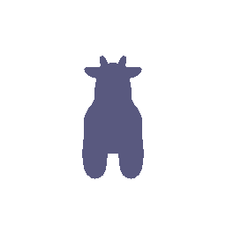


### 1.2 Re-creating the Dolly Zoom (10 points)

The [Dolly Zoom](https://en.wikipedia.org/wiki/Dolly_zoom) is a famous camera effect, first used in the Alfred Hitchcock film [Vertigo](https://www.youtube.com/watch?v=G7YJkBcRWB8). The core idea is to change the focal length of the camera while moving the camera in a way such that the subject is the same size in the frame, producing a rather unsettling effect.

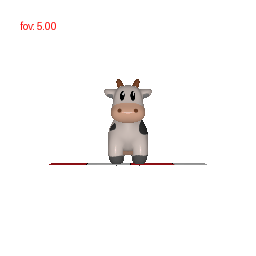

## 2. Practicing with Meshes (10 Points)

### 2.1 Constructing a Tetrahedron (5 points)

In this part, you will practice working with the geometry of 3D meshes.
Construct a tetrahedron mesh and then render it from multiple viewpoints. 

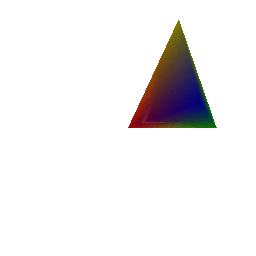

Since we have a tetrahedron, which has **four triangular faces, four vertices and six edges**, we can simply define the vertices as points of the mesh and each face of the tetrahedron becomes the triangular face of a mesh. This can easily be defined as 
```
vertices=torch.tensor([
            [0,0,0],
            [2,0,0],
            [1,0,2],
            [1,2,1]], dtype=torch.float32)
faces=torch.tensor([
            [0,1,2],
            [2,3,0],
            [2,1,3],
            [1,0,3]], dtype=torch.int64)
```
### 2.2 Constructing a Cube (5 points)

Constructing a cube mesh is not as direct as tetrahedron because each face of cube cannot directly become the face of mesh. We would rather need to define two triangles in each square face of cube. The number of vertices of cube are 8 and faces are 6 but since each face is square we need to define triangular faces in each square to be used for mesh generation. So two triangular faces in each square accounting to 12 triangular faces in total

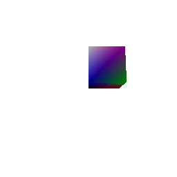

This is defined as 
```
vertices=torch.tensor([
    [0,0,0],
    [1,0,0],
    [1,0,1],
    [0,0,1],
    [0,1,0],
    [1,1,0],
    [1,1,1],
    [0,1,1]], dtype=torch.float32)
faces=torch.tensor([
    [0,4,5],
    [0,1,5],
    [2,1,5],
    [2,6,5],
    [3,2,6],
    [3,7,6],
    [3,0,4],
    [3,7,4],
    [7,4,5],
    [7,6,5],
    [3,0,1],
    [3,2,1]], dtype=torch.int64)
```
## 3. Re-texturing a mesh (10 points)

The front of the cow corresponds to the vertex with the smallest z-coordinate `z_min`, and the back of the cow corresponds to the vertex with the largest z-coordinate `z_max`. Then, we will assign the color of each vertex using linear interpolation based on the z-value of the vertex:
```python
alpha = (z - z_min) / (z_max - z_min)
color = alpha * color2 + (1 - alpha) * color1
```

The final output looks something like this:

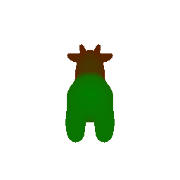

In this case, `color1 = [1, 0, 0]` i.e. RED and `color2 = [0, 1, 0]` i.e. GREEN.


## 4. Camera Transformations (10 points)

When working with 3D, finding a reasonable camera pose is often the first step to producing a useful visualization, and an important first step toward debugging.

Running `python -m starter.camera_transforms` produces the following image using the camera extrinsics rotation `R_0` and translation `T_0`:

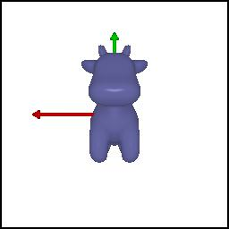

Since we are pre-multyplying the matrices by relative ones, R_relative would represent camera being rotated around its own optical axiz. And T would represent it’s the world-space position of the camera centre after accounting for both new rotation and any extra translation.

A set (R_relative, T_relative) such that the new camera extrinsics with `R = R_relative @ R_0` and `T = R_relative @ T_0 + T_relative` produces each of the following images are:

- The R-relative should rotate the camera by −90° about it's Z-axis. This can come from a standard -90degree rotation matrix along z and since there is no translation difference the T_relative should be 0.
`R_relative=[[0, 1, 0], [-1, 0, 0], [0, 0, 1]], T_relative=[0,0,0]`

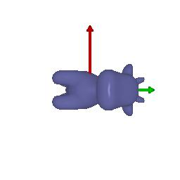

- There should be no rotation along any axis rather simple translation along the z axis. T tells the final position of camera in world cooridnates therefore R can be identity and T can be some fixed value (played around with this to get best match)
 `R_relative=[[1, 0, 0], [0, 1, 0], [0, 0, 1]], T_relative=[0,0,2]`

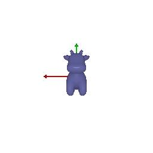


- The object shifts left and up in the frame, therefore, there should be no rotation but rather motion along both x and y axis. The actual value can be in the ballpark but the form of R and T should remain same with R being identity and T having some positive value on x (representing left) and negative on y(representing up)
 `R_relative=[[1, 0, 0], [0, 1, 0], [0, 0, 1]], T_relative=[0.5, -0.5, 0]`

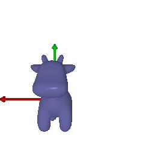


- This image requires rotation by +90° about the Y-axis, then a translation (left in X and forward in Z) keeping the camera at the original distance from centre.
 `R_relative=[[0, 0, 1], [0, 1, 0], [-1, 0, 0]], T_relative=[-3, 0, 3]`

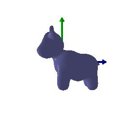


## 5. Rendering Generic 3D Representations (45 Points)

### 5.1 Rendering Point Clouds from RGB-D Images (10 points)

In this part, we will practice rendering point clouds constructed from 2 RGB-D images from the [Common Objects in 3D Dataset](https://github.com/facebookresearch/co3d).


<p float="left">
  <figure style="display:inline-block; margin-right:10px; text-align:center;">
    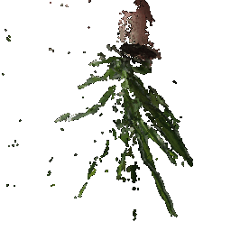
    <figcaption>View 1</figcaption>
  </figure>

  <figure style="display:inline-block; margin-right:10px; text-align:center;">
    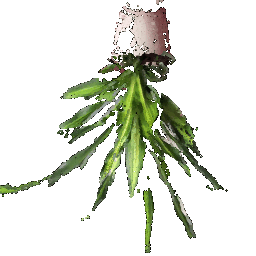
    <figcaption>View 2</figcaption>
  </figure>

  <figure style="display:inline-block; text-align:center;">
    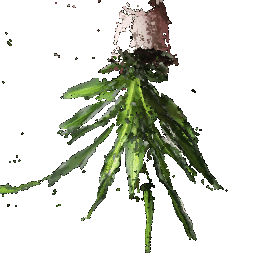
    <figcaption>Union of both</figcaption>
  </figure>
</p>

### 5.2 Parametric Functions (10 + 5 points)

A parametric function generates a 3D point for each point in the source domain. For example, given an elevation `theta` and azimuth `phi`, we can parameterize the surface of a unit sphere as `(sin(theta) * cos(phi), cos(theta), sin(theta) * sin(phi))`.

By sampling values of `theta` and `phi`, we can generate a sphere point cloud. 

Now we will render a [torus](https://en.wikipedia.org/wiki/Torus) point cloud by sampling its parametric function.

- We use the parametric definition of a torus as given on wikipedia- 
```
    x = (R + r*torch.sin(Theta)) * torch.cos(Phi)
    y = (R + r*torch.sin(Theta)) * torch.sin(Phi)
    z = r*torch.cos(Theta)
```
Where `Theta` and `Phi` can take any value from `0 to 2*pi`

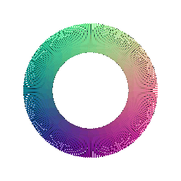

- For octahedron, we use an approximate definition (taken from ChatGPT) 
```
r_oct = 1.0 / (torch.abs(torch.sin(Theta) * torch.cos(Phi)) + 
            torch.abs(torch.sin(Theta) * torch.sin(Phi)) + 
            torch.abs(torch.cos(Theta)))

x = r_oct * torch.sin(Theta) * torch.cos(Phi)
y = r_oct * torch.sin(Theta) * torch.sin(Phi)
z = r_oct * torch.cos(Theta)

```
Where theta can take values between `0` and `pi` and phi `can` take values between `0` to `2*pi`

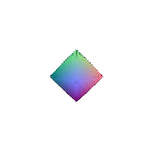


### 5.3 Implicit Surfaces (15 + 5 points)

In this part, we will explore representing geometry as a function in the form of an implicit function. In general, given a function F(x, y, z), we can define the surface to be the zero level-set of F i.e. (x,y,z) such that F(x, y, z) = 0. To visualize such a representation, we can discretize the 3D space and evaluate the implicit function, storing the values in a voxel grid. Finally, to recover the mesh, we can run the [marching cubes](https://en.wikipedia.org/wiki/Marching_cubes) algorithm to extract the 0-level set.

- To define torus as a voxel grid we use the defintion
```
X, Y, Z = torch.meshgrid([torch.linspace(min_value, max_value, voxel_size)] * 3)
voxels = (torch.sqrt(X**2 + Y**2) - R)**2 + Z**2 - r**2
```

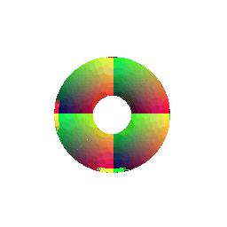

- To define an octahedron as a voxel grid we use the defintion
```
X, Y, Z = torch.meshgrid(torch.linspace(-2, 2, 100), 
                        torch.linspace(-2, 2, 100), 
                        torch.linspace(-2, 2, 100))
voxels = torch.abs(X) + torch.abs(Y) + torch.abs(Z) <= 1
    
```

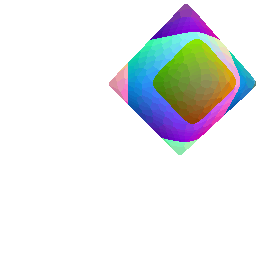

#### Comparision between rendering as a mesh vs as a point cloud
- **Rendering speed**: Point clouds render faster since they only plot points, while meshes take longer because surfaces and shading must be computed through rasterization.

- **Rendering quality**: Meshes give smoother surfaces and realistic lighting, whereas point clouds often look scattered and incomplete.

- **Ease of use**: Point clouds are simple to render as each point can be considered as a small sphere with corresponding colour, but meshes require extra steps like building connectivity, graphing surface normals and calcualting light features.

- **Memory usage**: Point clouds usually store just positions and color, while meshes need both vertices and face data. At a low level meshes store points similar to point clouds but also another array (or some other data structure) holding the indices of points that form a face, so they use more memory.

****

## 6. Do Something Fun (10 points)

Now that you have learned to work with various 3D represenations and render them, it
is time to try something fun. Create your own 3D structures, or render something in an interesting way,
or creatively texture, or anything else that appeals to you - the (3D) world is your oyster!
If you wish to download additional meshes,  [Free3D](https://free3d.com/) is a good place to start.

### 6.1 Disco Cow Animation

For this section, I created a disco cow animation that combines multiple rendering techniques:

- **Rotating camera**: 360-degree camera rotation around the scene
- **Dynamic lighting**: Colored lights that change color over time using sine waves
- **Moving light source**: The light orbits around the cow creating dynamic shadows
- **Floor geometry**: Simple floor mesh to ground the cow in the scene

The animation creates a disco effect where the cow and floor are illuminated by moving colored lights, creating a disco-like visualization.

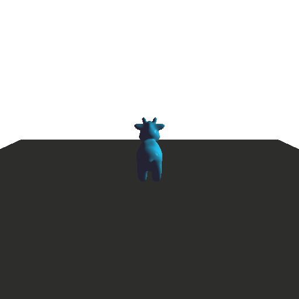


