# 16-825 Assignment 2: Single View to 3D

## 1. Exploring loss functions

### 1.1. Fitting a voxel grid (5 points)
The loss function used for voxels is a cross entropy loss, represented as follows:
```
    voxel_src_clamped = torch.clamp(voxel_src, 1e-7, 1 - 1e-7)
    critertia = F.binary_cross_entropy
    loss = critertia(voxel_src_clamped, voxel_tgt)
```
#### Visuals of the optimized voxel grid along-side the ground truth voxel grid.
| Ground Truth Voxel | Predicted Voxel |
|---------------------------|------------------------|
| 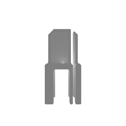 | 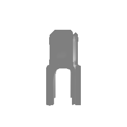 |

### 1.2. Fitting a point cloud (5 points)
The loss function used for point clouds is chamfer_loss, represented as follows:
```
    dist = (point_cloud_src[:, :, None, :] - point_cloud_tgt[:, None, :, :]).pow(2).sum(-1)
    min_src_tgt = dist.min(dim=2).values
    min_tgt_src = dist.min(dim=1).values

    loss_chamfer = (min_src_tgt.sum(dim=1) + min_tgt_src.sum(dim=1)).mean()	
```
#### Visuals of the optimized point cloud along-side the ground truth  point cloud.
| Ground Truth Point Cloud | Predicted Point Cloud |
|---------------------------|------------------------|
| 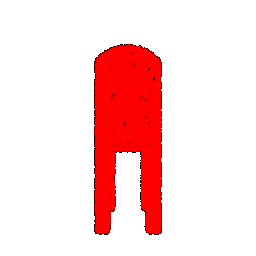 | 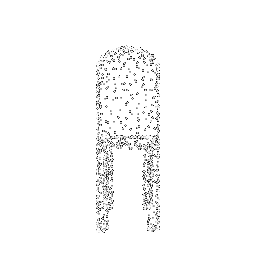 

### 1.3. Fitting a mesh (5 points)
The loss function used for mesh is chamfer_loss, same as poitn clouds, and a smoothness loss represented as follows:
```
	verts=mesh_src.verts_list()[0]
	k=6
	
	dist=verts.unsqueeze(1) - verts.unsqueeze(0)
	dist=(dist.pow(2).sum(dim=2)).pow(0.5)
	
	nearest_neighs=(torch.topk(dist, k,dim=1,largest=False).indices)[:,1:]   # N X K-1
	neighbors=verts[nearest_neighs]
	centre=neighbors.mean(1)

	temp=((verts-centre)**2).sum(1)
	loss_laplacian=(temp**0.5).mean(0)
```

#### Visuals of the optimized mesh along-side the ground truth mesh.
| Ground Truth mesh | Predicted Mesh |
|---------------------------|------------------------|
| 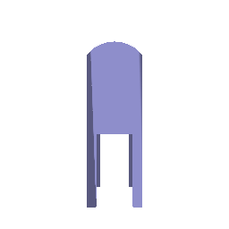 | 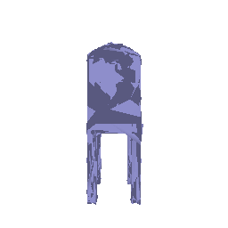 

## 2. Reconstructing 3D from single view
This section will involve training a single view to 3D pipeline for voxels, point clouds and meshes.

### 2.1. Image to voxel grid (20 points)
#### Decoder network 
```
# Input: b x 512
# Output: b x 32 x 32 x 32
self.decoder = nn.Sequential(
	nn.Unflatten(1, (64, 2, 2, 2)),
	nn.ConvTranspose3d(64, 32, 4, 2, 1),
	nn.BatchNorm3d(32),
	nn.ReLU(inplace=True),

	nn.ConvTranspose3d(32, 16, 4, 2, 1),
	nn.BatchNorm3d(16),
	nn.ReLU(inplace=True),

	nn.ConvTranspose3d(16, 8, 4, 2, 1),
	nn.BatchNorm3d(8),
	nn.ReLU(inplace=True),

	nn.ConvTranspose3d(8, 4, 4, 2, 1),
	nn.BatchNorm3d(4),
	nn.ReLU(inplace=True),
	
	nn.ConvTranspose3d(4, 1, 3, 1, 1),
	nn.Sigmoid(),
)
```
#### Visuals of three examples in the test set. 
| Input Image | Ground Truth Voxel | Predicted Voxel |
|--------------|---------------------------|------------------------|
|  |  | 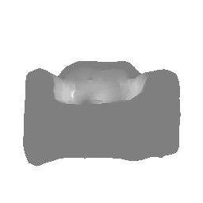 |
| 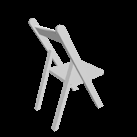 |  | 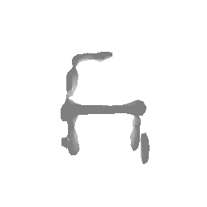 |
| 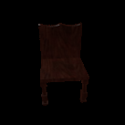 | 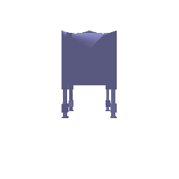 | 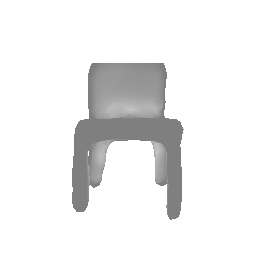 |
| 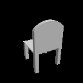 | 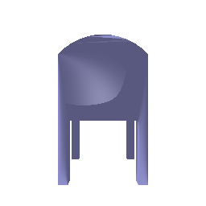 | 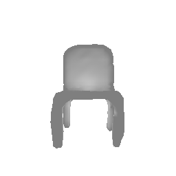 |

### 2.2. Image to point cloud (20 points)
#### Decoder network 
Citing AtlasNet-

	The architecture of our decoder is 4 fully-connected layers
	of size 1024, 512, 256, 128 with ReLU non-linearities on
	the first three layers and tanh on the final output layer

```
	# Input: b x 512
	# Output: b x args.n_points x 3  

	self.decoder = nn.Sequential(
		nn.Linear(512, 1024),
		nn.ReLU(inplace=True),
		nn.Linear(1024, 512),
		nn.ReLU(inplace=True),
		nn.Linear(512, 256),
		nn.ReLU(inplace=True),
		nn.Linear(256, 128),
		nn.ReLU(inplace=True),
		nn.Linear(128, self.n_point*3),
		nn.Unflatten(1, (self.n_point, 3)),
	)
```
#### Visuals of three examples in the test set. 
| Input Image | Ground Truth Point Cloud | Predicted Point Cloud |
|--------------|---------------------------|------------------------|
|  |  | 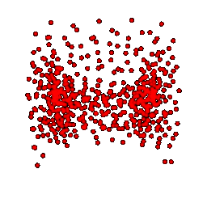 |
| 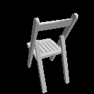 |  | 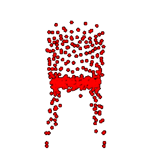 |
|  | 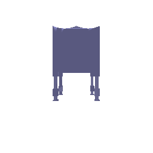 | 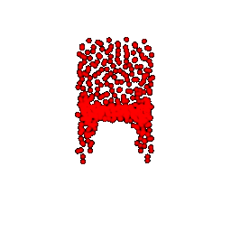 |
| 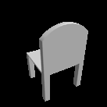 | 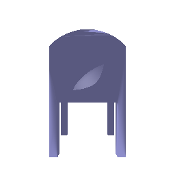 | 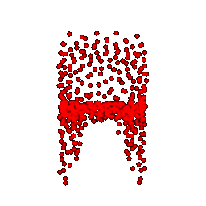 |

### 2.3. Image to mesh (20 points)
#### Decoder network 
```
	# Input: b x 512
	# Output: b x mesh_pred.verts_packed().shape[0] x 3  

	self.decoder = nn.Sequential(
		nn.Linear(512,1024),
		nn.ReLU(inplace=True),
		nn.Linear(1024,1024),
		nn.ReLU(inplace=True),
		nn.Linear(1024,1024),
		nn.ReLU(inplace=True),
		nn.Linear(1024,mesh_pred.verts_packed().shape[0]*3),
		nn.Tanh(),
		nn.Unflatten(1, (mesh_pred.verts_packed().shape[0],3)),
	)
```
#### Visuals of three examples in the test set. 

| Input Image | Ground Truth Mesh | Predicted Mesh |
|--------------|---------------------------|------------------------|
|  |  | 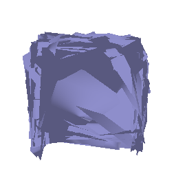 |
|  |  | 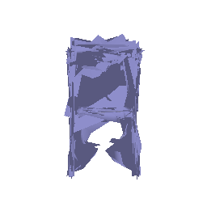 |
| 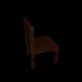 | 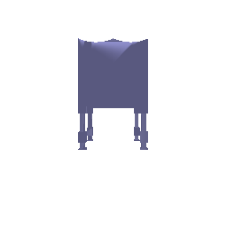 | 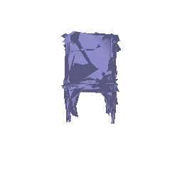 |
| 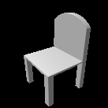 |  | 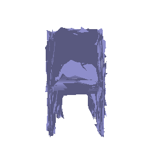 |

### 2.4. Quantitative comparisions(10 points)
#### Quantitative comparision of the F1 scores for meshes vs pointcloud vs voxelgrids.

| Voxels | Mesh | Point Cloud |
|-|-|-|
| 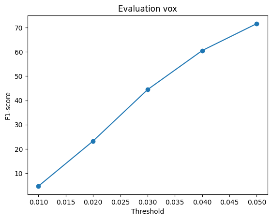 | 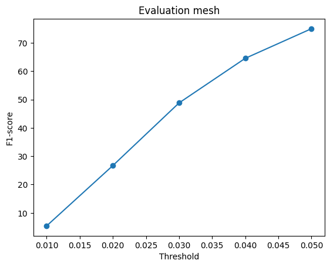 | 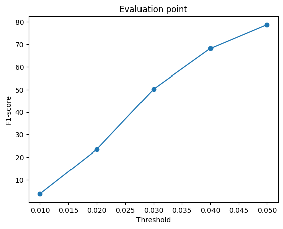 |

The average F1@0.05 scores at the highest threshold are: 
- Point Cloud = 77.50,
- Mesh = 75.03, and 
- Voxel = 72.33

All three plots show the F1 increasing with threshold, meaning the reconstruction aligns better with the ground truth as we allow a larger distance tolerance. The performance differences arise directly from how each representation models 3D geometry:

- Point clouds represent geometry as continuous 3D samples. They capture detailed local structure without being tied to a grid, giving higher precision and recall. Their flexibility explains the highest F1 scores overall.

- Meshes provide connected, smooth surfaces, which should ideally be most accurate. However, small alignment or scale mismatches between predicted and groundtruth meshes can sharply penalize F1, slightly lowering their average compared to point clouds.

- Voxel grids discretize space into fixed cells. This makes learning and inference simple but limits resolution as fine edges and thin structures are lost. Hence, voxels achieve lower F1, especially at small thresholds, because their geometry is coarse and blocky.

Thus, each model’s F1 performance reflects its inherent trade off. Voxels are limited by discretization, meshes by sensitivity to registration, and point clouds strike the best balance between flexibility and precision.

### 2.5. Analyse effects of hyperparams variations (10 points)
Analyse the results, by varying a hyperparameter of your choice.
For example `n_points` or `vox_size` or `w_chamfer` or `initial mesh (ico_sphere)` etc.
Try to be unique and conclusive in your analysis.

### 2.6. Interpret your model (15 points)
Simply seeing final predictions and numerical evaluations is not always insightful. Can you create some visualizations that help highlight what your learned model does? Be creative and think of what visualizations would help you gain insights. There is no `right' answer - although reading some papers to get inspiration might give you ideas.


## 3. Exploring other architectures / datasets.

### 3.3 Extended dataset for training (10 points)
In the extended dataset, we provide a `split_3c.json` file that specifies the train/test split for the extended dataset.

Update `dataset_location.py` so that we train the 3D reconstruction model on an extended dataset containing three classes (chair, car, and plane). Choose at least one of three models (voxel, point cloud, or mesh) to train and evaluate.

After training, compare the quantitative and qualitative results of "training on one class" VS "training on three classes". Explain your thoughts and analysis.

(Hints: for example, given the same testing samples in `chair` class, how does F1 score change comparing "training on one class" and "training on three classes"? How does the 3D consistency / diversity of the output samples change?)
