Assignment 3 : Neural Volume Rendering and Surface Rendering
===================================

# A. Neural Volume Rendering (80 points)

## 0. Transmittance Calculation (10 points)
A ray through a non-homogeneous medium. The medium is composed of 3 segments (y1y2, y2y3, y3y4). Each segment has a different absorption coefficient, shown as σ1,σ2,σ3 in the figure. The length of each segment is also annotated in the figure (1m means 1 meter). As shown in Figure 1, we observe a ray going through a non-homogeneous medium. Please compute the following transmittance:
•T(y1,y2)
•T(y2,y4)
•T(x,y4)
•T(x,y3)
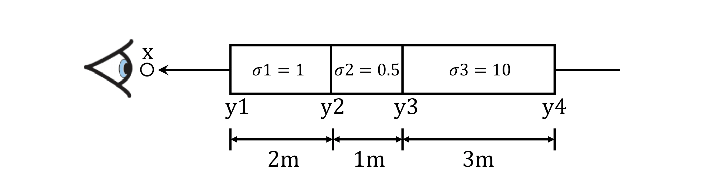

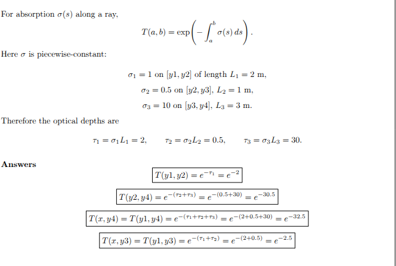


##  1. Differentiable Volume Rendering

##  1.3. Ray sampling (5 points)

Visualization of `xy_grid` and `rays` with the `vis_grid` and `vis_rays` functions in the `render_images` function.

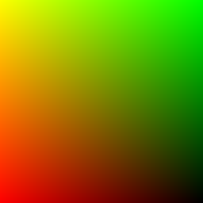    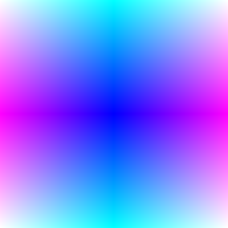

##  1.4. Point sampling (5 points)

Using the `render_points` method in `render_functions.py` to visualize the point samples from the first camera.

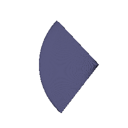

##  1.5. Volume rendering (20 points)

### Visualization

Visualization of the depth using spinnign box

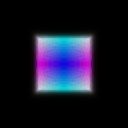 <!-- 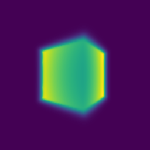 -->


##  2. Optimizing a basic implicit volume

##  2.2. Loss and training (5 points)
Loss as mean squared error between the predicted colors and ground truth colors `rgb_gt`.

```python
loss = torch.sum((out['feature']-rgb_gt)**2)
```

The optimized box center is at $(0.25, 0.25, 0.00)$ and the side lengths are $(2.00, 1.50, 1.50)$.

##  2.3. Visualization

A spiral sequence of the optimized volume

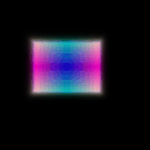


##  3. Optimizing a Neural Radiance Field (NeRF) (20 points)


## Visualization
Spiral rendering generated after training a NeRF for 250 epochs on 128x128 low-resolution images.

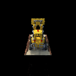

##  4. NeRF Extras (CHOOSE ONE! More than one is extra credit)

###  4.1 View Dependence (10 points)
Employing the high-res materials scene to show the view-dependent results 

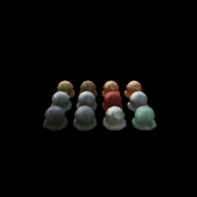

# B. Neural Surface Rendering (50 points)

##  5. Sphere Tracing (10 points)

**My implementaiton:**
```python
def sphere_tracing( self, implicit_fn, origins, directions, ):
    
    points=origins.clone()
    for _ in range(self.max_iters):
        distance=implicit_fn(points)
        points=points+distance*directions
    mask= distance<0.01

    return (points, mask)
```

**Rendering:**

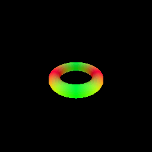

**Description:**
In my sphere tracing implementation, I approximate ray surface intersections by repeatedly stepping closer to the zero-level set of the SDF. I initialize the current point as the ray origin and, for a fixed number of iterations, query the SDF to get the distance to the closest surface, then move the point forward by distance along the rays direction. Any ray, who's final distance is below a small threshold, is marked as intersecting and point of intersection is updated.

##  6. Optimizing a Neural SDF (15 points)


Defining the `eikonal_loss` as :
```python
loss= torch.mean((torch.linalg.norm(gradients,dim=1)-1)**2)
```

Visualizing the input point cloud used for training, and the prediction,


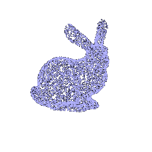 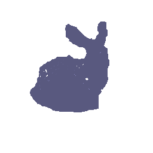

The SDF branch starts with `HarmonicEmbedding(3, n_harmonic_functions_xyz)`, then passes through `n_layers_distance` fully connected layers of width `n_hidden_neurons_distance`, with skip connections that concatenate the original embedding at selected depths (4 in this case). A final linear layer outputs a single scalar SDF per point. Unlike NeRF, the SDF branch uses a linear output head without activation, since the signed distance value is unbounded and can take both positive and negative values. During training the gradients are regressed to 1, i.e. forcing unit norm through the eikonal regularizer which encouragesthe network to learn a SDF and not any arbitrary function.

##  7. VolSDF (15 points)

This will save `part_7_geometry.gif` and `part_7.gif`. 

Rendering with default `alpha: 10.0` and `beta: 0.05`

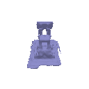 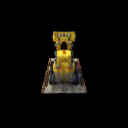


**An intuitive explanation of what the parameters `alpha` and `beta` are doing here. Also, answer the following questions:**

β controls the sharpness of the SDF-to-density transition, while α scales the overall opacity or density value. The tanh term converts signed distances into a soft occupancy field i.e. points near the surface (SDF≈0) have higher density, and faraway points have lower density.


**1. How does high `beta` bias your learned SDF? What about low `beta`?**
With high β, the tanh curve becomes flatter, so the transition from surface to empty space is smoother. The SDF is biased toward broader, blurrier surfaces, as density changes gradually. With low β, the tanh curve is steeper, making density sharply concentrated around the zero-level set. The SDF approximates a crisper, more localized surface.

**2. Would an SDF be easier to train with volume rendering and low `beta` or high `beta`? Why?**
A high β makes the optimization easier at the start because gradients are smoother and more stable for volume rendering (the network sees a larger region with nonzero density).

**3. Would you be more likely to learn an accurate surface with high `beta` or low `beta`? Why?**
A low β makes training harder initially (narrow gradient region) but yields a more accurate surface once converged, since it better enforces a sharp boundary.

**Experiment with hyper-parameters to and attach your best results on your webpage. Comment on the settings you chose, and why they seem to work well.**

| Tuned Params | Default Params |
|---------------------------|------------------------|
| 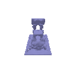 | |
|  ||

I used **α = 15.0** and **β = 0.03**, which produced the clearest reconstruction with well-defined edges and realistic opacity. The slightly higher α increased interior density for stronger surface visibility, while the lower β created a sharper SDF-to-density transition, yielding crisp surface boundaries without introducing instability during training.
## 8. Neural Surface Extras (CHOOSE ONE! More than one is extra credit)

### 8.1. Render a Large Scene with Sphere Tracing (10 points)
The power of Sphere Tracing lies in the fact that it can render complex scenes efficiently. To observe this, we define a scene with a central sphere orbited by primitive formations, 8 spheres, 3 angled rings, 6 boxes, and 12 tiny spheres trying to mimick a space like scene. 

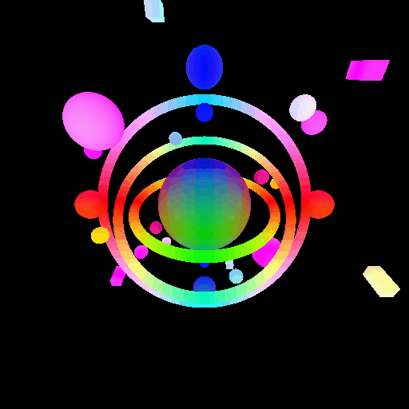