# 16-825 Assignment 4

# 1. 3D Gaussian Splatting

## 1.1 3D Gaussian Rasterization (35 points)

In this section, we implemented a 3D Gaussian rasterization pipeline in PyTorch. The official implementation uses custom CUDA code and several optimizations to make the rendering very fast. For simplicity, our implementation avoids many of the tricks and optimizations used by the official implementation. Additionally, instead of using all the spherical harmonic coefficients to model view dependent effects, we only use the view independent components.

### 1.1.1 Project 3D Gaussians to Obtain 2D Gaussians

A 3D Gaussian is parameterized by its mean (a 3 dimensional vector) and covariance (a 3x3 matrix). Following equations (5) and (6) of the [original paper](https://repo-sam.inria.fr/fungraph/3d-gaussian-splatting/3d_gaussian_splatting_low.pdf), we can obtain a 2D Gaussian (parameterized by a 2D mean vector and 2x2 covariance matrix) that represents an approximation of the projection of a 3D Gaussian to the image plane of a camera.

### 1.1.5 Perform Splatting

Given `N` ordered 2D Gaussians, we can compute the colour value at a single pixel location $\mathbf{x}$ by:

$$
  C_{\mathbf{x}} = \sum_{i = 1}^{N} c_i \alpha_{(\mathbf{x}, i)} T_{(\mathbf{x}, i)}
$$

Here, $c_i$ is the colour contribution of each Gaussian, which is a learnable parameter. Similar equations were used to compute the depth and silhouette (mask) maps.

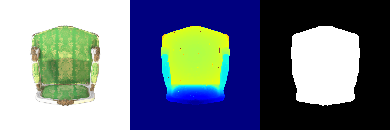

## 1.2 Training 3D Gaussian Representations (15 points)

We trained a 3D representation of a toy truck given multi-view data and a point cloud. The point cloud was used to initialize the means of the 3D Gaussians. For ease of implementation, we performed training using **isotropic** Gaussians.

### 1.2.1 Setting Up Parameters and Optimizer

### 1.2.2 Perform Forward Pass and Compute Loss

**Training Configuration:**
- Learning rates:
  - Means: 0.00015
  - Opacities: 0.00085
  - Colours: 0.02
  - Scales: 0.001
- Number of iterations: 1000

**Metrics:**
- PSNR: 28.361
- SSIM: 0.926

**Training Progress:**

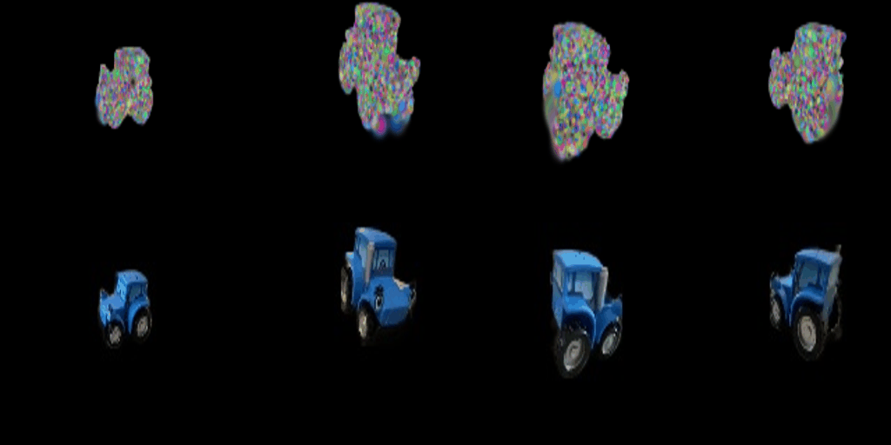

**Final Renders:**

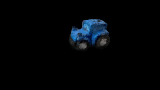

## 1.3 Extensions

### 1.3.1 Rendering Using Spherical Harmonics (10 Points)

In the previous sections, we implemented a 3D Gaussian rasterizer that is view independent. To model view dependent effects, the authors of the 3D Gaussian Splatting paper use spherical harmonics.

**With Spherical Harmonics (All Components):**

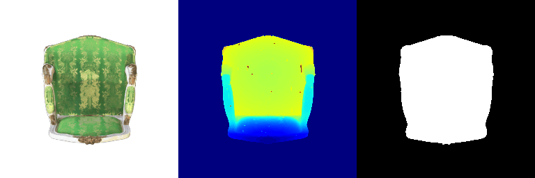

**Without Spherical Harmonics (DC Component Only):**

**Side-by-Side Comparisons:**

| Without SH (Frame 0) | With SH (Frame 0) |
|----------------------|-------------------|
| 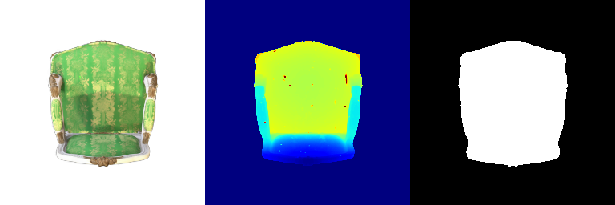 |  |

| Without SH (Frame 10) | With SH (Frame 10) |
|----------------------|-------------------|
| 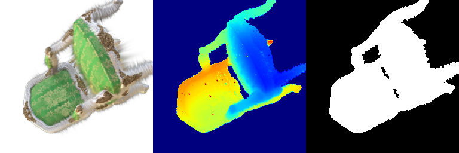 | 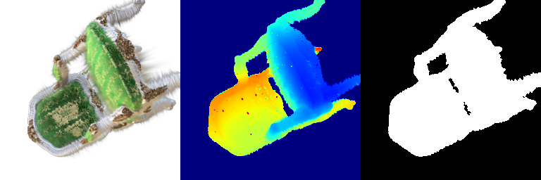 |

| Without SH (Frame 20) | With SH (Frame 20) |
|----------------------|-------------------|
|  | 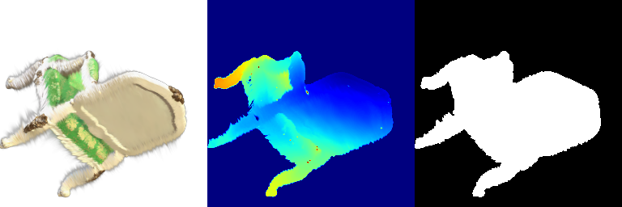 |

| Without SH (Frame 30) | With SH (Frame 30) |
|----------------------|-------------------|
|  | 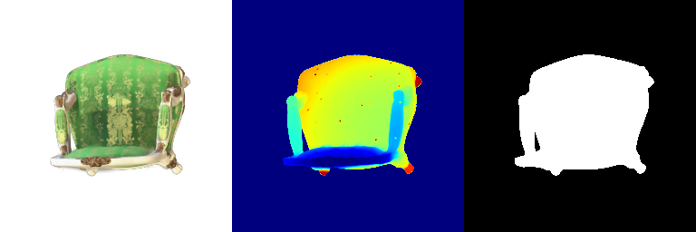 |

**Observations:**
- The renders with spherical harmonics show improved view-dependent effects and better capture lighting variations across different viewing angles.
- The DC-only version appears flatter and lacks the subtle color variations present in the full spherical harmonic version.
- Highlights and reflections are more pronounced and realistic with the full spherical harmonics implementation.

---

# 2. Diffusion-guided Optimization

## 2.1 SDS Loss + Image Optimization (20 points)

We implemented the SDS (Score Distillation Sampling) loss following the [DreamFusion](https://arxiv.org/pdf/2209.14988.pdf) paper. The implementation includes both:

1. SDS without guidance (positive prompts only)
2. SDS with guidance (positive and negative prompts)

The classifier-free guidance significantly improves sampling fidelity and generative results by mixing the score estimates of a conditional diffusion model and an unconditional diffusion model.

**Prompt: "a hamburger"**

| Without Guidance (2000 iterations) | With Guidance (2000 iterations) |
|----------------------------------|--------------------------------|
| 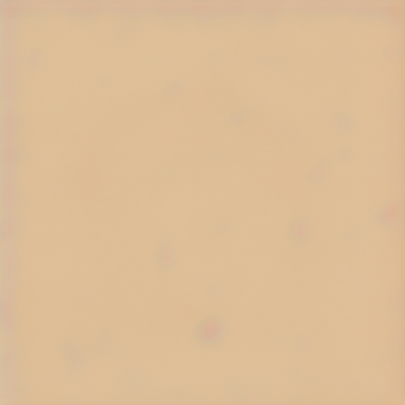 | 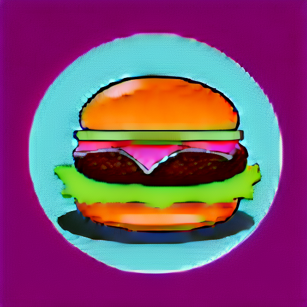 |

**Prompt: "a standing corgi dog"**

| Without Guidance (2000 iterations) | With Guidance (2000 iterations) |
|----------------------------------|--------------------------------|
|  | 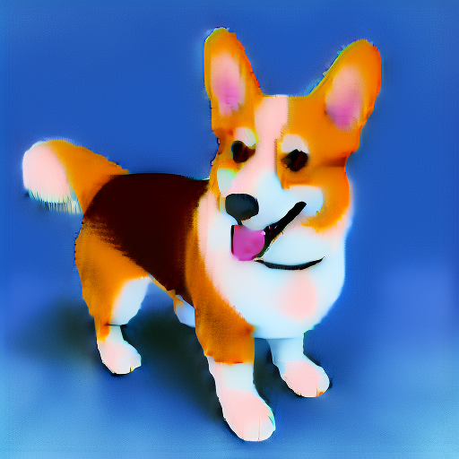 |

**Prompt: "a hamster lifting weights"**

| Without Guidance (2000 iterations) | With Guidance (2000 iterations) |
|----------------------------------|--------------------------------|
|  | 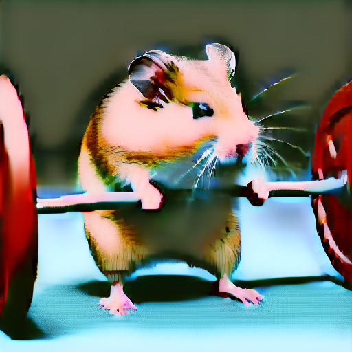 |

**Prompt: "a frog riding a skateboard"**

| Without Guidance (2000 iterations) | With Guidance (2000 iterations) |
|----------------------------------|--------------------------------|
|  | 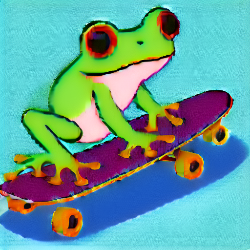 |

## 2.2 Texture Map Optimization for Mesh (15 points)

We optimized the texture map of a cow mesh with fixed geometry using SDS loss. The texture map is represented by a ColorField, similar to the NeRF architecture. In each iteration, we randomly sampled a camera pose (and optionally a light condition), rendered the camera view, and computed SDS loss on the rendered image.

**Prompt: "a pink polka dotted cow"**

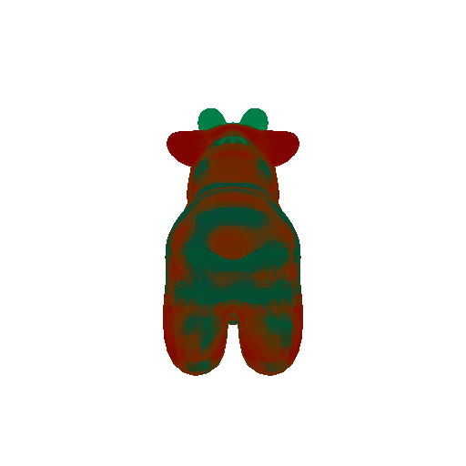

**Prompt: "an orange cow"**

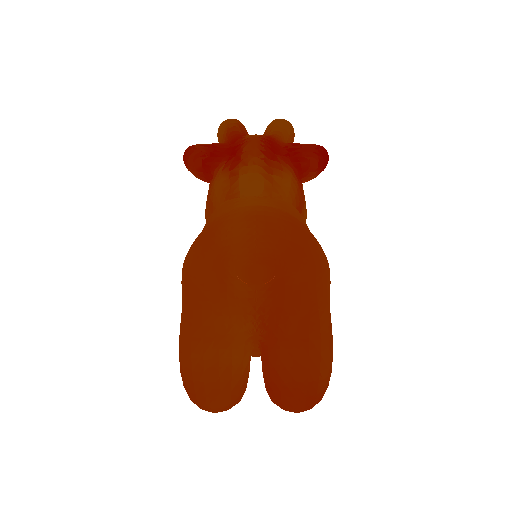

## 2.3 NeRF Optimization (15 points)

We optimized a NeRF model where both geometry and color are learnable. Following the original [DreamFusion](https://arxiv.org/pdf/2209.14988.pdf) paper, we implemented:

1. **Regularization terms**: Tuned the loss weight hyperparameters `lambda_entropy` and `lambda_orient` to get reasonable results.
   - lambda_entropy: 1e-4
   - lambda_orient: 1e-2

2. **Shading methods**: Tuned the parameter `latent_iter_ratio` so that the model uses `normal` shading at the beginning as a warmup then switches to "random" shading between `textureless` and `lambertian`.
   - latent_iter_ratio: 0.2

#### Prompt: "a standing corgi dog"

| RGB | Depth |
|-----|-------|
| <video src="Q2/output/nerf/a_standing_corgi_dog/videos/rgb_ep_99.mp4" controls width="300"></video> | <video src="Q2/output/nerf/a_standing_corgi_dog/videos/depth_ep_99.mp4" controls width="300"></video> |

#### Prompt: "a hamburger"

| RGB | Depth |
|-----|-------|
| <video src="Q2/output/nerf/a_hamburger/videos/rgb_ep_99.mp4" controls width="300"></video> | <video src="Q2/output/nerf/a_hamburger/videos/depth_ep_99.mp4" controls width="300"></video> |

#### Prompt: "a hamster holding a barbell"

| RGB | Depth |
|-----|-------|
| <video src="Q2/output/nerf/a_hamster_holding_a_barbell/videos/rgb_ep_99.mp4" controls width="300"></video> | <video src="Q2/output/nerf/a_hamster_holding_a_barbell/videos/depth_ep_99.mp4" controls width="300"></video> |

## 2.4 Extensions

### 2.4.1 View-dependent text embedding (10 points)

The DreamFusion paper proposes using view-dependent text embedding to obtain better 3D consistent results. This helps address the issue where NeRF results may not be 3D consistent (e.g., multiple front faces across different views) because SDS optimizes each rendered view independently without considering the viewing angle.

#### Prompt: "a standing corgi dog"

| RGB | Depth |
|-----|-------|
| <video src="Q2/output/nerf/a_standing_corgi_dog_view_dep/videos/rgb_ep_99.mp4" controls width="300"></video> | <video src="Q2/output/nerf/a_standing_corgi_dog_view_dep/videos/depth_ep_99.mp4" controls width="300"></video> |

#### Prompt: "a hamster holding a barbell"
| RGB | Depth |
|-----|-------|
| <video src="Q2/output/nerf/a_hamster_holding_a_barbell_view_dep/videos/rgb_ep_99.mp4" controls width="300"></video> | <video src="Q2/output/nerf/a_hamster_holding_a_barbell_view_dep/videos/depth_ep_99.mp4" controls width="300"></video> |

**Analysis:**
The view-dependent text conditioning provides improved 3D consistency by incorporating viewing angle information into the text embeddings. This helps ensure that the NeRF optimizes towards a coherent 3D structure rather than a collection of independently optimized 2D views. The results show more stable geometry across different viewpoints and reduced artifacts such as multiple faces appearing from different angles.
