# 16-825 Assignment 5: PointNet for Classification and Segmentation

## Overview
In this assignment, a PointNet based architecture for classification and segmentation with point clouds is implemented. Q1 and Q2 focus on implementing, training and testing models. Q3 quantitatively analyzes model robustness.

## Table of Contents

- [Q1. Classification Model (40 points)](#q1-classification-model-40-points)
- [Q2. Segmentation Model (40 points)](#q2-segmentation-model-40-points)
- [Q3. Robustness Analysis (20 points)](#q3-robustness-analysis-20-points)

## Q1. Classification Model (40 points)

**Overall Test Accuracy: 92.96%**

### Visualizations

The visualizations show the original point cloud colored based on the predicted class label (Red = Chair, Green = Vase, Blue = Lamp).

#### Correct Predictions

**Chair (Class 0):**
| Ground Truth | Prediction |
|--------------|------------|
|  |  |

**Vase (Class 1):**
| Ground Truth | Prediction |
|--------------|------------|
| 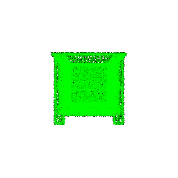 |  |

**Lamp (Class 2):**
| Ground Truth | Prediction |
|--------------|------------|
| 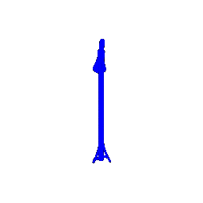 |  |

#### Failure Cases

Interestingly, no misclassified chair samples were found in the test set, indicating that the model performs very well on chair classification. However, failure cases were found for vases and lamps:

**Vase Misclassified as chair:**
| Ground Truth (Vase) | Prediction |
|---------------------|------------|
| 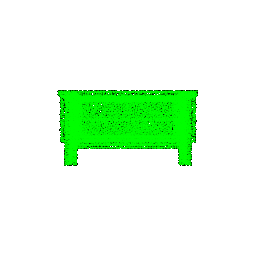 |  |

**Lamp Misclassified as vase:**
| Ground Truth (Lamp) | Prediction |
|---------------------|------------|
| 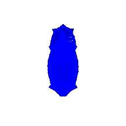 | 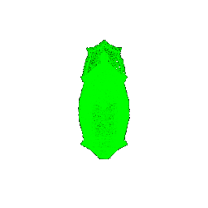 |

The failure cases reveal interesting patterns in the model's learned representations. The vase misclassified as a chair suggests that certain vase shapes with vertical structures might share geometric features with chairs, particularly in their overall silhouette. Similarly, the lamp misclassified as a vase indicates that lamps with rounded bases and vertical elements can be confused with vases. The absence of chair misclassifications suggests that chairs have more distinctive geometric features (such as seat-back-leg structures) that the model learns to distinguish effectively. These failures highlight that the model relies heavily on global shape features rather than fine-grained details, which can lead to confusion between geometrically similar object classes.

## Q2. Segmentation Model (40 points)

**Overall Test Accuracy: 82.77%**

### Visualizations

The visualizations show point clouds colored by their segmentation labels.

#### Good Predictions

**Sample 0 (Accuracy: 87.53%):**
| Ground Truth | Prediction |
|--------------|------------|
| 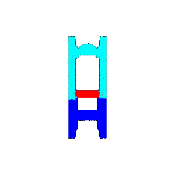 | 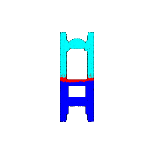 |

**Sample 1 (Accuracy: 86.35%):**
| Ground Truth | Prediction |
|--------------|------------|
| 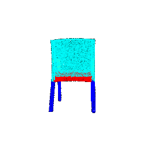 | 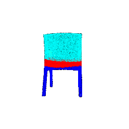 |

**Sample 2 (Accuracy: 96.70%):**
| Ground Truth | Prediction |
|--------------|------------|
| 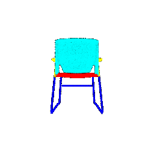 | 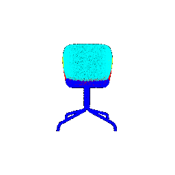 |

**Sample 3 (Accuracy: 94.69%):**
| Ground Truth | Prediction |
|--------------|------------|
| 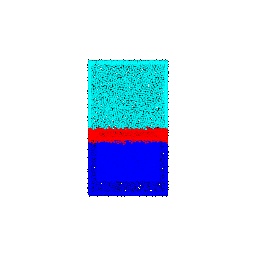 | 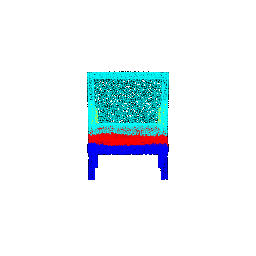 |

#### Poor Predictions

**Sample 4 (Accuracy: 62.60%):**
| Ground Truth | Prediction |
|--------------|------------|
| 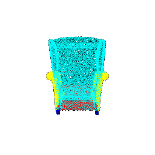 | 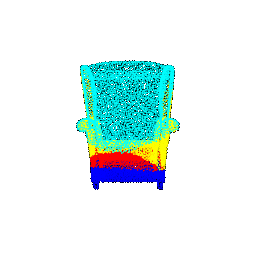 |

**Sample 5 (Accuracy: 79.50%):**
| Ground Truth | Prediction |
|--------------|------------|
| 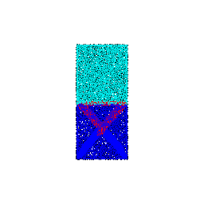 | 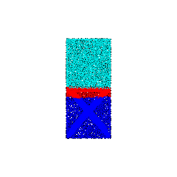 |

The segmentation results show that the model performs well on most chair samples (86-96% accuracy), successfully segmenting major parts like legs, seat, back, and arms. However, the model struggles on certain samples (62.6% and 79.5% accuracy), which likely have complex geometries, occluded parts, or ambiguous boundaries between segments. The high accuracy on most samples demonstrates that PointNet can effectively learn to segment chair parts, but performance degrades when dealing with non-standard chair designs or when point density is insufficient to capture fine details. The variation in accuracy across samples suggests that the model's performance is sensitive to the specific geometry and point distribution of each object.

## Q3. Robustness Analysis (20 points)

### Q3.1: Rotation Experiments

To test the robustness of both models, input point clouds were rotated by various angles (10°, 30°, 60°, 90°) around the Y-axis.

#### Classification - Rotation Robustness

| Rotation | Test Accuracy | Ground Truth | Prediction |
|----------|---------------|--------------|------------|
| 10° | 91.29% |  |  |
| 30° | 54.66% |  | 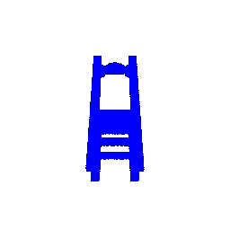 |
| 60° | 25.28% | 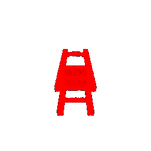 | 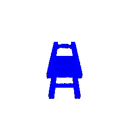 |
| 90° | 21.30% |  | 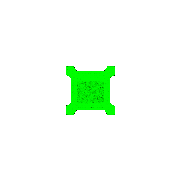 |

The rotation experiments reveal that the classification model is highly sensitive to rotation, with accuracy dropping dramatically from 91.29% at 10° rotation to only 21.30% at 90° rotation. This significant degradation indicates that PointNet without rotation augmentation learns orientation-specific features rather than rotation-invariant representations. The model appears to rely heavily on the canonical orientation seen during training, where objects are typically upright. As the rotation angle increases, the geometric features that the model learned become misaligned with the rotated input, causing severe performance degradation. This highlights a key limitation of the basic PointNet architecture: without explicit rotation-invariant features or data augmentation, the model cannot generalize to rotated inputs.

#### Segmentation - Rotation Robustness

| Rotation | Test Accuracy | Sample Accuracy | Ground Truth | Prediction |
|----------|---------------|-----------------|--------------|------------|
| 10° | 82.10% | 94.49% | 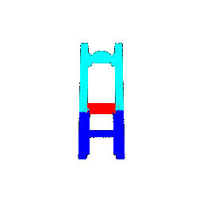 | 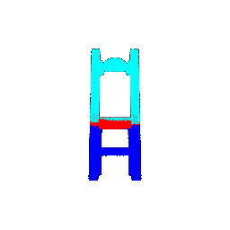 |
| 30° | 67.78% | 64.11% | 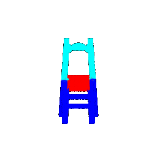 | 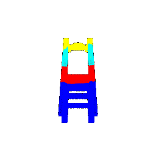 |
| 60° | 29.51% | 51.40% | 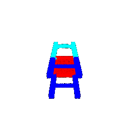 | 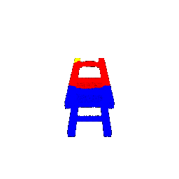 |
| 90° | 25.94% | 39.28% | 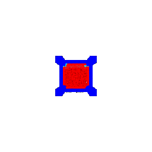 | 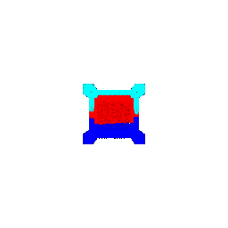 |

Similar to classification, the segmentation model shows significant sensitivity to rotation, with test accuracy dropping from 82.10% at 10° to 25.94% at 90° rotation. Interestingly, at 10° rotation, the sample accuracy (94.49%) is actually higher than the test accuracy (82.10%), suggesting that the specific sample used for visualization is more robust to small rotations than the average test sample. However, as rotation increases, both metrics drop substantially. The segmentation task is particularly challenging under rotation because the spatial relationships between different parts (legs, seat, back) change with orientation, and the model struggles to maintain correct part assignments when these relationships are altered. This demonstrates that point-level segmentation requires precise spatial understanding that is disrupted by rotation.

### Q3.2: Point Count Experiments

To test the robustness of both models, the number of points sampled per object was varied (100, 1000, 2000, 5000, 10000 points).

#### Classification - Point Count Robustness

| Points | Test Accuracy | Ground Truth | Prediction |
|--------|---------------|--------------|------------|
| 100 | 91.50% | 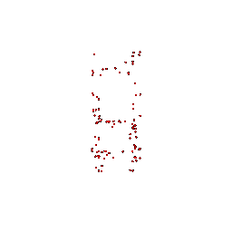 |  |
| 1000 | 92.65% |  | 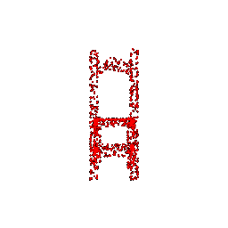 |
| 2000 | 92.65% | 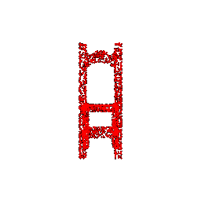 |  |
| 5000 | 92.86% | 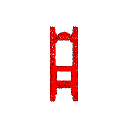 |  |
| 10000 | 92.96% |  |  |

The point count experiments demonstrate that the classification model is remarkably robust to variations in point density. Accuracy remains high (91.50%) even with only 100 points per object, dropping by less than 1.5% compared to the full 10,000 points (92.96%). This robustness stems from PointNet's use of max pooling, which aggregates global features from all points regardless of their density. The max pooling operation extracts the most salient features from the point cloud, making the model relatively insensitive to the total number of points as long as the key discriminative features are present. The slight improvement with more points (from 91.50% to 92.96%) suggests that additional points help capture finer details and provide more stable feature extraction, but the core classification capability is maintained even with sparse point clouds.

#### Segmentation - Point Count Robustness

| Points | Test Accuracy | Sample Accuracy | Ground Truth | Prediction |
|--------|---------------|-----------------|--------------|------------|
| 100 | 79.87% | 77.00% | 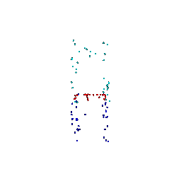 | 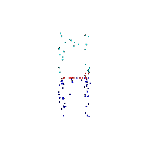 |
| 1000 | 82.18% | 88.50% | 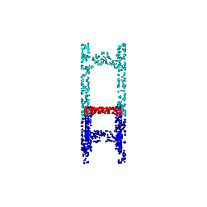 | 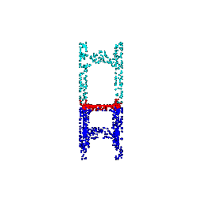 |
| 2000 | 82.58% | 89.35% | 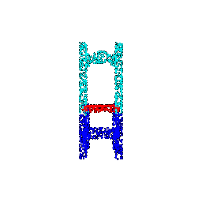 | 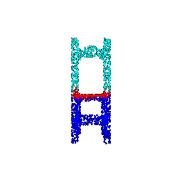 |
| 5000 | 82.71% | 86.88% | 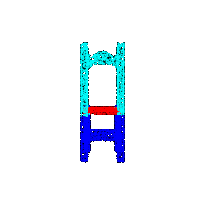 | 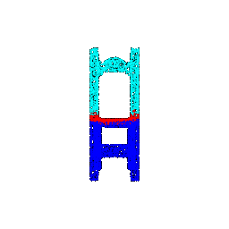 |
| 10000 | 82.77% | 87.53% |  | 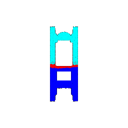 |

The segmentation model also shows good robustness to point count variations, with test accuracy ranging from 79.87% (100 points) to 82.77% (10,000 points). However, there's more variation in sample accuracy (ranging from 77% to 89.35%), indicating that individual object performance can vary significantly with point density. The relatively stable test accuracy suggests that PointNet's architecture can handle different point densities for segmentation, though performance improves with more points as they provide better coverage of object surfaces and boundaries. The variation in sample accuracy highlights that some objects require more points to accurately segment all parts, particularly when dealing with fine details or complex geometries. Overall, the model maintains reasonable segmentation quality even with sparse point clouds, demonstrating the effectiveness of the per-point feature extraction approach.
